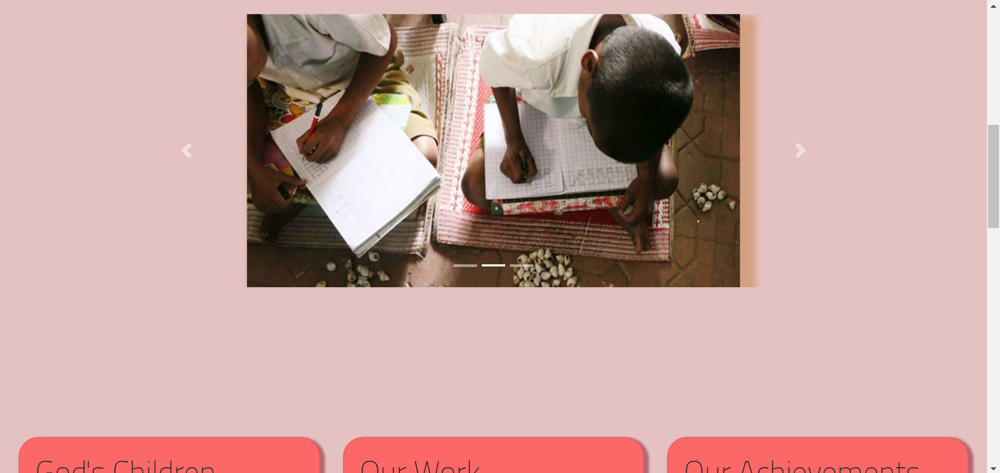
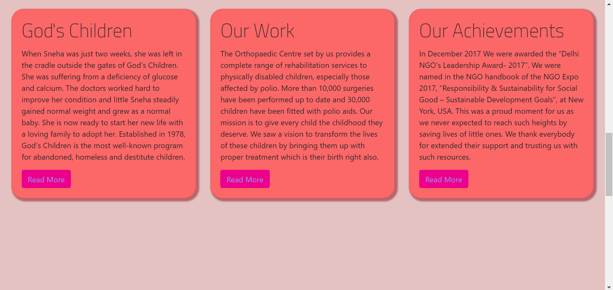
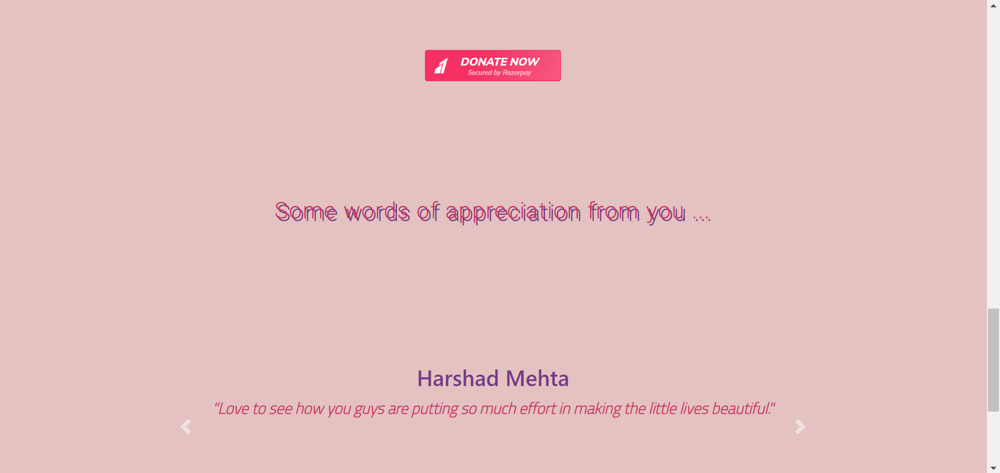
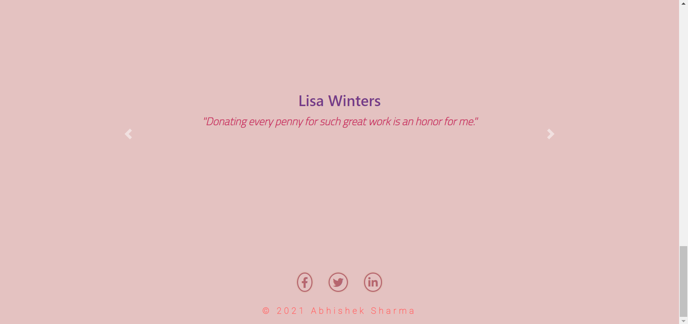
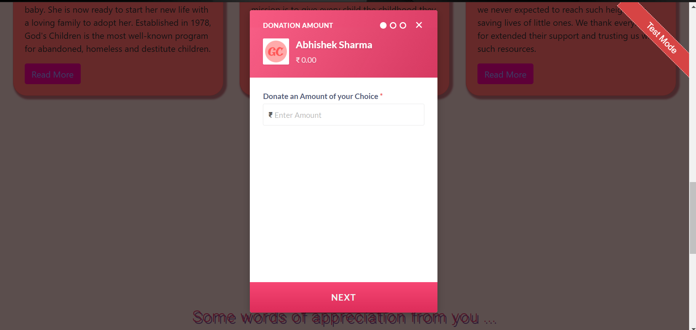

## THE SPARKS FOUNDATION 
### GRIP APRIL 2021
### INTERNSHIP TYPE : WEB DEVELOPMENT AND DESIGNING
### TASK NUMBER : TASK #3
### TOPIC : PAYMENT GATEWAY INTEGRATION 

---

### ABOUT

This is a cross platform web application that uses RazorPay Payment Gateway Integration API in test mode in order to check out the test transactions. The UI is built with the help of HTML, CSS and Bootstrap Classes.  

### SCREENSHOTS

